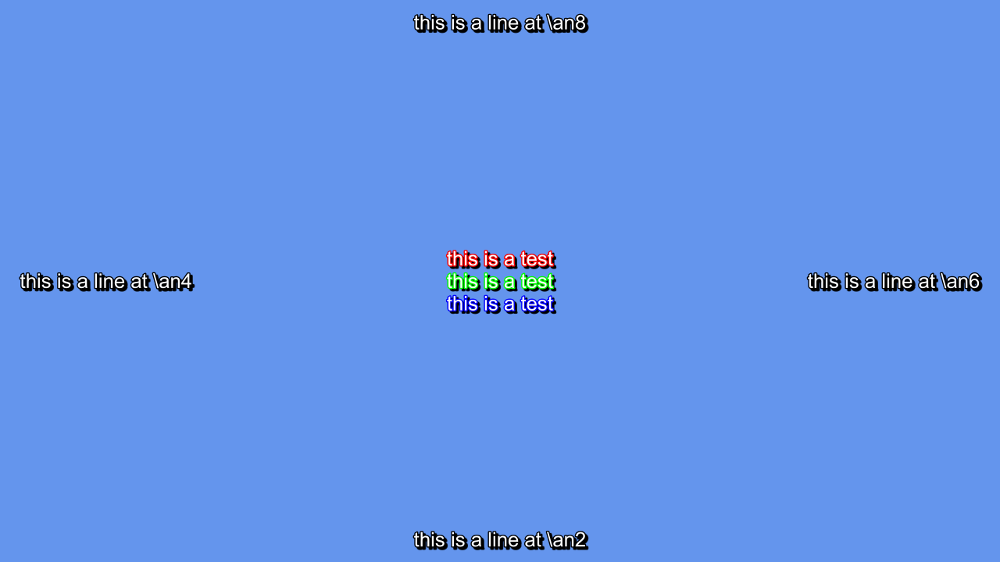

# python-ass

A library for parsing and manipulating Advanced SubStation Alpha subtitle
files.

## Documents

**test.ass**

    [Script Info]
    ScriptType: v4.00+

    [V4+ Styles]
    Format: Name, Fontname, Fontsize, PrimaryColour, SecondaryColour, OutlineColour, BackColour, Bold, Italic, Underline, StrikeOut, ScaleX, ScaleY, Spacing, Angle, BorderStyle, Outline, Shadow, Alignment, MarginL, MarginR, MarginV, Encoding
    Style: Default,Arial,20,&H00FFFFFF,&H000000FF,&H00000000,&H00000000,0,0,0,0,100,100,0,0,1,2,2,2,10,10,10,1

    [Events]
    Format: Layer, Start, End, Style, Name, MarginL, MarginR, MarginV, Effect, Text
    Dialogue: 0,0:00:00.00,0:00:05.00,Default,,0,0,0,,hello!

You can parse the file:

    >>> import ass
    >>> with open("test.ass", "r") as f:
    ...     doc = ass.parse(f)
    ...

Access some of its styles:

    >>> doc.styles
    [<ass.document.Style object at ...>]
    >>> doc.styles[0].fontname
    'Arial'
    >>> doc.styles[0].primary_color  # "color", not "colour"
    Color(r=0xff, g=0xff, b=0xff, a=0x00)

Or its event lines:

    >>> doc.events
    [<ass.document.Dialogue object at ...>]
    >>> doc.events[0].text
    'hello!'

You can dump them back out into ASS format, too:

    >>> doc.events[0].dump()
    '0,0:00:00.00,0:00:05.00,Default,,0,0,0,,hello!'

Or maybe the whole file:

    >>> with open("out.ass", "w") as f:
    ...     doc.dump_file(f)
    ...

## Rendering

python-ass can use libass for rendering.

First you need to allocate a libass context:

    >>> ctx = ass.renderer.Context()

Then you need to convert the `ass.document.Document` to a `ass.renderer.Track`:

    >>> t = ctx.make_track()
    >>> t.populate(doc)

Then make a renderer to render the track:

    >>> r = ctx.make_renderer()
    >>> r.set_fonts(fontconfig_config="/usr/local/etc/fonts/fonts.conf")
    >>> r.set_all_sizes((1280, 720))

You can render a frame at a given time:

    >>> imgs = r.render_frame(t, timedelta(0))

Example using PIL to render to a bitmap:

    >>> im_out = Image.new("RGB", (1280, 720))
    >>> im_data = im_out.load()
    >>> for img in imgs:
    ...     r, g, b, a = img.rgba
    ...     for y in range(img.h):
    ...         for x in range(img.w):
    ...             a_src = img[x, y] * (256 - a) // 256
    ...             r_dst, g_dst, b_dst = im_data[x + img.dst_x, y + img.dst_y]
    ...             r_out = ((r * a_src) + (r_dst * (256 - a_src))) // 256
    ...             g_out = ((g * a_src) + (g_dst * (256 - a_src))) // 256
    ...             b_out = ((b * a_src) + (b_dst * (256 - a_src))) // 256
    ...             im_data[x + img.dst_x, y + img.dst_y] = (r_out, g_out, b_out)
    ...
    >>> im_out.show()

### Sample Rendering (from `renderer_test.py`)

